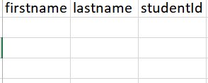

# Team HeadLights CSV certificates gen

## Overview

This repo contains an express application that generates json certificates from a csv file

## Setup

To run the app locally simple clone via

```bash
git clone https://github.com/Ayo-Awe/headlights-certificate-gen.git
```

Install dependencies via (Assuming you already have node installed)

```bash
npm install
```

Start the application via

```bash
npm start
```

or in development mode

```bash
npm run dev
```

## Usage

The application contains only a single POST endpoint `/certificates`

It supports the content-type `multipart/form-data`. The fields expected are as follows

- file - the csv file
- organisationName - name of organisation
- companyLogo - imageUrl for company logo

**Sample Request**

```js
var formdata = new FormData();
formdata.append(
  "file",
  fileInput.files[0],
  "/C:/Users/Hp Envy 17/Downloads/test.csv"
);
formdata.append("organisationName", "Samuel Cake Factory");
formdata.append("companyLogo", "logo.png");

var requestOptions = {
  method: "POST",
  body: formdata,
  redirect: "follow",
};

fetch("http://localhost:8080/", requestOptions)
  .then((response) => response.text())
  .then((result) => console.log(result))
  .catch((error) => console.log("error", error));
```

**Sample Response**

```json
{
  "certificates": [
    {
      "firstname": "bola",
      "lastname": "tinubu",
      "studentId": "3",
      "organisationName": "Samuel Cake Factory",
      "imageUrl": "logo.png"
    },
    {
      "firstname": "shola",
      "lastname": "Debo",
      "studentId": "4",
      "organisationName": "Samuel Cake Factory",
      "imageUrl": "logo.png"
    },
    {
      "firstname": "Seyi",
      "lastname": "Loyal",
      "studentId": "5",
      "organisationName": "Samuel Cake Factory",
      "imageUrl": "logo.png"
    },
    {
      "firstname": "Temi",
      "lastname": "Rega",
      "studentId": "6",
      "organisationName": "Samuel Cake Factory",
      "imageUrl": "logo.png"
    },
    {
      "firstname": "Samuel",
      "lastname": "Bode",
      "studentId": "7",
      "organisationName": "Samuel Cake Factory",
      "imageUrl": "logo.png"
    },
    {
      "firstname": "Faraday",
      "lastname": "Skillz",
      "studentId": "8",
      "organisationName": "Samuel Cake Factory",
      "imageUrl": "logo.png"
    }
  ],
  "totalCertificates": 6,
  "success": true
}
```

Note that for the format above the csv has to be in the following format

Failure to do so would result in unexpected behaviour

## Deployment

This application is currently live [here](https://headlights-certificate-gen.onrender.com)
